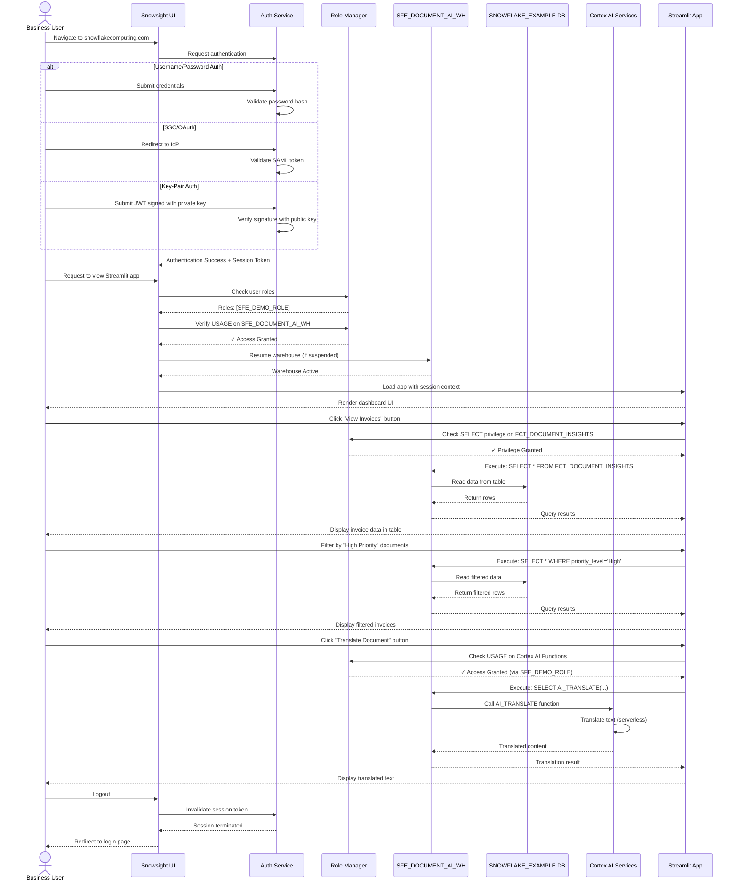

# Auth Flow - AI Document Processing Demo

**Author:** SE Community
**Last Updated:** 2025-12-10
**Status:** Reference Implementation


**Reference Implementation:** This code demonstrates production-grade architectural patterns and best practices. Review and customize security, networking, and logic for your organization's specific requirements before deployment.

## Overview

This diagram shows the authentication and authorization flow for users accessing the AI document processing demo, from initial login through role-based access control to data query execution.

## Diagram



## Authentication Methods

### 1. Username/Password (Default for Demo)

**Flow:**
1. User enters username + password in Snowsight
2. Snowflake hashes password and compares to stored hash
3. On success, issues session token (JWT)
4. Token valid for configured session timeout (default 4 hours)

**Security:**
- Passwords hashed with bcrypt (salted)
- Enforce minimum password complexity (configurable)
- Optional MFA via Duo Security

**Setup:**
```sql
-- Create demo user
CREATE USER demo_user
  PASSWORD = 'SecureP@ssw0rd!'
  DEFAULT_ROLE = SFE_DEMO_ROLE
  MUST_CHANGE_PASSWORD = FALSE
  COMMENT = 'DEMO: Sample user for document processing demo';
```

### 2. SSO/OAuth (Recommended for Production)

**Supported Providers:**
- Okta
- Microsoft Azure AD
- Google Workspace
- Any SAML 2.0 compliant IdP

**Flow:**
1. User clicks "Sign in with SSO"
2. Redirected to corporate IdP login page
3. IdP validates credentials (outside Snowflake)
4. IdP returns SAML assertion to Snowflake
5. Snowflake validates assertion, issues session token

**Benefits:**
- Centralized identity management
- Single sign-on across applications
- Corporate password policies enforced
- Automatic account provisioning/deprovisioning

**Setup (Example - Okta):**
```sql
-- Configure SAML integration
CREATE SECURITY INTEGRATION okta_sso
  TYPE = SAML2
  ENABLED = TRUE
  SAML2_ISSUER = 'http://www.okta.com/exampleorg'
  SAML2_SSO_URL = 'https://example.okta.com/app/snowflake/exampleorg/sso/saml'
  SAML2_PROVIDER = 'OKTA'
  SAML2_X509_CERT = '-----BEGIN CERTIFICATE-----
MIIDpDCCAoygAwIBAgIGAXo...
-----END CERTIFICATE-----';
```

### 3. Key-Pair Authentication (Programmatic Access)

**Use Case:** Automated scripts, API integrations, CI/CD pipelines

**Flow:**
1. User generates RSA key pair (2048-bit minimum)
2. Public key registered with Snowflake user account
3. Client signs JWT with private key
4. Snowflake verifies signature with public key
5. On success, issues session token

**Setup:**
```bash
# Generate key pair (user's local machine)
openssl genrsa 2048 | openssl pkcs8 -topk8 -inform PEM -out rsa_key.p8 -nocrypt
openssl rsa -in rsa_key.p8 -pubout -out rsa_key.pub

# Register public key in Snowflake
ALTER USER demo_user SET RSA_PUBLIC_KEY='MIIBIjANBgkqhki...';
```

## Authorization (Role-Based Access Control)

### Role Hierarchy

```
ACCOUNTADMIN (full account access)
  └─ SECURITYADMIN (manage users/roles)
      └─ SYSADMIN (manage databases/warehouses)
          └─ SFE_DEMO_ROLE (application-specific role)
              └─ PUBLIC (default role, minimal access)
```

### Demo Role Privileges

**SFE_DEMO_ROLE** is granted:

```sql
-- Warehouse access
GRANT USAGE ON WAREHOUSE SFE_DOCUMENT_AI_WH TO ROLE SFE_DEMO_ROLE;

-- Database access
GRANT USAGE ON DATABASE SNOWFLAKE_EXAMPLE TO ROLE SFE_DEMO_ROLE;

-- Schema access (all SFE_* schemas)
GRANT USAGE ON ALL SCHEMAS IN DATABASE SNOWFLAKE_EXAMPLE TO ROLE SFE_DEMO_ROLE;

-- Read access to analytics tables
GRANT SELECT ON ALL TABLES IN SCHEMA SFE_ANALYTICS_ENTERTAINMENT TO ROLE SFE_DEMO_ROLE;

-- Write access to staging (for processing pipeline)
GRANT SELECT, INSERT, UPDATE ON ALL TABLES IN SCHEMA SFE_STG_ENTERTAINMENT TO ROLE SFE_DEMO_ROLE;

-- Read-only access to raw data
GRANT SELECT ON ALL TABLES IN SCHEMA SFE_RAW_ENTERTAINMENT TO ROLE SFE_DEMO_ROLE;

-- Cortex AI function usage (implicitly granted via warehouse)
-- No explicit grant needed - users with USAGE on warehouse can call AI functions
```

### Privilege Verification

**Check current role and privileges:**
```sql
-- View current session details
SELECT CURRENT_ROLE(), CURRENT_USER(), CURRENT_WAREHOUSE(), CURRENT_DATABASE();

-- View all roles granted to current user
SHOW GRANTS TO USER CURRENT_USER();

-- View privileges granted to SFE_DEMO_ROLE
SHOW GRANTS TO ROLE SFE_DEMO_ROLE;
```

## Security Boundaries

### What Users CAN Do

✅ **Analytics Layer:**
- Query `FCT_DOCUMENT_INSIGHTS` table
- View `V_PROCESSING_METRICS` monitoring view
- Access Streamlit dashboard
- Export query results (CSV, JSON)

✅ **AI Processing:**
- Call AI_PARSE_DOCUMENT on raw documents
- Call AI_TRANSLATE on parsed text
- Call AI_FILTER to classify documents
- Call AI_AGG to aggregate insights

✅ **Staging Layer:**
- Read parsed documents from `STG_PARSED_DOCUMENTS`
- Insert new processing results
- Update processing status flags

### What Users CANNOT Do

❌ **Account Administration:**
- Create/drop databases
- Create/drop warehouses
- Manage users or roles
- View account-level usage data

❌ **Production Systems:**
- Access non-SFE_* objects
- Modify other databases
- Create network policies
- Alter security integrations

❌ **Raw Document Modification:**
- Delete documents from `RAW_*` tables
- Update binary PDF content
- Drop raw data tables
- Truncate raw data

### Data Protection

**Row-Level Security:** Not implemented in demo (all users see all data)

**Column-Level Security:** Not implemented in demo

**Dynamic Data Masking:** Not implemented in demo

**Recommendation for Production:**
```sql
-- Example: Mask sensitive vendor data for non-finance roles
CREATE MASKING POLICY mask_vendor_name AS (val STRING) RETURNS STRING ->
  CASE
    WHEN CURRENT_ROLE() IN ('FINANCE_ADMIN', 'ACCOUNTADMIN') THEN val
    ELSE '***MASKED***'
  END;

-- Apply to vendor_name column
ALTER TABLE RAW_INVOICES MODIFY COLUMN vendor_name SET MASKING POLICY mask_vendor_name;
```

## Session Management

### Session Lifecycle

1. **Authentication:** User logs in → Session token issued
2. **Active:** User queries data, token refreshed automatically
3. **Idle:** No queries for 4 hours (default) → Session expires
4. **Logout:** User clicks logout → Token invalidated immediately

### Session Settings

```sql
-- View current session timeout
SHOW PARAMETERS LIKE 'CLIENT_SESSION_KEEP_ALIVE_HEARTBEAT_FREQUENCY' IN ACCOUNT;

-- Extend session timeout (ACCOUNTADMIN only)
ALTER ACCOUNT SET CLIENT_SESSION_KEEP_ALIVE = TRUE;
ALTER ACCOUNT SET CLIENT_SESSION_KEEP_ALIVE_HEARTBEAT_FREQUENCY = 3600; -- 1 hour
```

### Security Best Practices

**✅ Do:**
- Use SSO for production deployments
- Enforce MFA for ACCOUNTADMIN role
- Rotate key-pairs regularly (every 90 days)
- Set minimum password complexity
- Log authentication events for audit

**❌ Don't:**
- Share user accounts between team members
- Store passwords in plain text (scripts, notebooks)
- Grant ACCOUNTADMIN for application access
- Disable session timeouts
- Use default passwords

## Audit & Compliance

### Login History

```sql
-- View recent login attempts
SELECT
    user_name,
    event_timestamp,
    event_type,
    is_success,
    error_code,
    error_message,
    reported_client_type,
    first_authentication_factor
FROM SNOWFLAKE.ACCOUNT_USAGE.LOGIN_HISTORY
WHERE event_timestamp >= DATEADD(day, -7, CURRENT_TIMESTAMP())
ORDER BY event_timestamp DESC;
```

### Access History

```sql
-- View recent data access by user
SELECT
    user_name,
    query_start_time,
    direct_objects_accessed,
    base_objects_accessed,
    objects_modified
FROM SNOWFLAKE.ACCOUNT_USAGE.ACCESS_HISTORY
WHERE user_name = 'DEMO_USER'
  AND query_start_time >= DATEADD(day, -7, CURRENT_TIMESTAMP())
ORDER BY query_start_time DESC;
```

### Grant Changes

```sql
-- View recent privilege grants/revokes
SELECT
    created_on,
    modified_on,
    privilege,
    granted_on,
    name AS object_name,
    granted_to,
    grantee_name,
    granted_by
FROM SNOWFLAKE.ACCOUNT_USAGE.GRANTS_TO_ROLES
WHERE grantee_name = 'SFE_DEMO_ROLE'
ORDER BY modified_on DESC;
```

## Troubleshooting Auth Issues

### Problem: User cannot login

**Possible Causes:**
1. Account locked due to failed login attempts
2. Password expired (MUST_CHANGE_PASSWORD flag)
3. Network policy blocking IP address
4. SSO misconfiguration

**Solutions:**
```sql
-- Unlock user account (ACCOUNTADMIN)
ALTER USER demo_user SET MINS_TO_UNLOCK = 0;

-- Reset password
ALTER USER demo_user SET PASSWORD = 'NewSecureP@ssw0rd!';

-- Disable password expiration for demo
ALTER USER demo_user SET MUST_CHANGE_PASSWORD = FALSE;
```

### Problem: User lacks permissions to view data

**Possible Causes:**
1. Role not granted to user
2. Role lacks necessary privileges
3. User using wrong role (not SFE_DEMO_ROLE)

**Solutions:**
```sql
-- Grant role to user
GRANT ROLE SFE_DEMO_ROLE TO USER demo_user;

-- Set as default role
ALTER USER demo_user SET DEFAULT_ROLE = SFE_DEMO_ROLE;

-- User can manually switch roles in Snowsight UI or via SQL:
USE ROLE SFE_DEMO_ROLE;
```

### Problem: Streamlit app fails to load

**Possible Causes:**
1. User lacks USAGE on warehouse
2. Streamlit app not deployed correctly
3. App trying to access objects outside granted schemas

**Solutions:**
```sql
-- Grant warehouse access
GRANT USAGE ON WAREHOUSE SFE_DOCUMENT_AI_WH TO ROLE SFE_DEMO_ROLE;

-- Verify Streamlit deployment
SHOW STREAMLITS IN SCHEMA SFE_ANALYTICS_ENTERTAINMENT;

-- Check app logs for permission errors
SELECT * FROM TABLE(
    INFORMATION_SCHEMA.STREAMLIT_LOGS('SFE_DOCUMENT_DASHBOARD')
) ORDER BY TIMESTAMP DESC LIMIT 100;
```

## Change History

See `.cursor/DIAGRAM_CHANGELOG.md` for version history.

---

**Last Updated:** 2025-11-24
**Author:** SE Community
