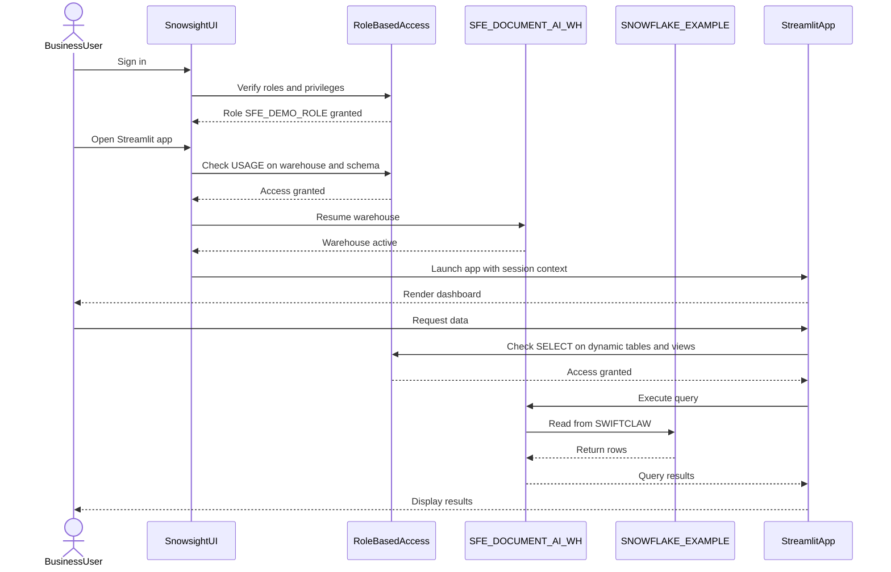

# Auth Flow - AI Document Processing Demo

**Author:** SE Community  
**Last Updated:** 2026-01-21  
**Status:** Reference Implementation


**Reference Implementation:** This diagram reflects production-grade patterns. Review and customize security, networking, and logic for your organization before production deployment.

## Overview

This diagram shows the authentication and authorization flow for users accessing the Streamlit dashboard and querying Dynamic Tables in the `SWIFTCLAW` schema.

## Diagram



## Role and Privileges

**SFE_DEMO_ROLE** should have:

```sql
GRANT USAGE ON WAREHOUSE SFE_DOCUMENT_AI_WH TO ROLE SFE_DEMO_ROLE;
GRANT USAGE ON DATABASE SNOWFLAKE_EXAMPLE TO ROLE SFE_DEMO_ROLE;
GRANT USAGE ON SCHEMA SNOWFLAKE_EXAMPLE.SWIFTCLAW TO ROLE SFE_DEMO_ROLE;
GRANT SELECT ON ALL DYNAMIC TABLES IN SCHEMA SNOWFLAKE_EXAMPLE.SWIFTCLAW TO ROLE SFE_DEMO_ROLE;
GRANT SELECT ON ALL VIEWS IN SCHEMA SNOWFLAKE_EXAMPLE.SWIFTCLAW TO ROLE SFE_DEMO_ROLE;
```

---

**Last Updated:** 2026-01-21  
**Author:** SE Community

