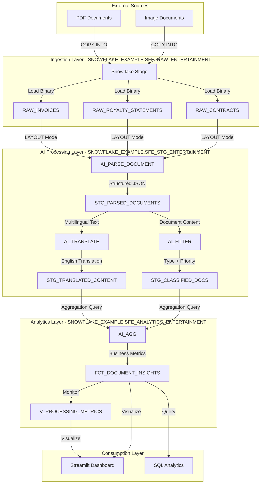

# Data Flow - AI Document Processing Demo

**Author:** SE Community  
**Last Updated:** 2025-11-24  
**Expires:** 2025-12-24 (30 days from creation)  
**Status:** Reference Implementation


**Reference Implementation:** This code demonstrates production-grade architectural patterns and best practices. Review and customize security, networking, and logic for your organization's specific requirements before deployment.

## Overview

This diagram shows how document data flows through the AI processing pipeline, from raw PDF ingestion through AI transformation to business insights. Each stage uses Snowflake's native AI Functions for intelligent document processing.

## Diagram



## Data Flow Stages

### Stage 1: Document Ingestion
**Input:** PDF/Image files from external systems  
**Process:** COPY INTO command loads files to Snowflake stage  
**Output:** Binary data in RAW_* tables  
**Technology:** Snowflake internal stage, COPY INTO command  
**Format:** Binary PDF content + metadata (vendor, date, language)

**Transformation Logic:**
```sql
-- Load documents from stage to raw table
COPY INTO RAW_INVOICES (document_id, pdf_content, vendor_name, upload_date, original_language)
FROM @SFE_DOCUMENT_STAGE/invoices/
FILE_FORMAT = (TYPE = 'CSV' FIELD_OPTIONALLY_ENCLOSED_BY = '"')
PATTERN = '.*\.pdf$';
```

### Stage 2: AI Document Parsing
**Input:** Binary PDF content from RAW_* tables  
**Process:** AI_PARSE_DOCUMENT extracts text + preserves table layouts  
**Output:** Structured JSON in STG_PARSED_DOCUMENTS  
**Technology:** SNOWFLAKE.CORTEX.PARSE_DOCUMENT  
**Format:** VARIANT (JSON) with extracted text, tables, layout

**Transformation Logic:**
```sql
-- Parse documents with AI
INSERT INTO STG_PARSED_DOCUMENTS (parsed_id, document_id, parsed_content, confidence_score)
SELECT 
    UUID_STRING() AS parsed_id,
    document_id,
    SNOWFLAKE.CORTEX.PARSE_DOCUMENT(pdf_content, {'mode': 'LAYOUT'}) AS parsed_content,
    parsed_content:confidence::FLOAT AS confidence_score
FROM RAW_INVOICES
WHERE processed_flag = FALSE;
```

**Data Quality:**
- Confidence threshold: 0.80 (80% minimum for auto-processing)
- Manual review queue: Confidence < 0.80
- Layout preservation: Tables, headers, footers maintained

### Stage 3: AI Translation
**Input:** Parsed text content from STG_PARSED_DOCUMENTS  
**Process:** AI_TRANSLATE converts non-English content to English  
**Output:** Translated JSON in STG_TRANSLATED_CONTENT  
**Technology:** SNOWFLAKE.CORTEX.TRANSLATE  
**Format:** VARIANT with source + translated text, confidence scores

**Transformation Logic:**
```sql
-- Translate non-English content
INSERT INTO STG_TRANSLATED_CONTENT (translation_id, parsed_id, translated_content)
SELECT 
    UUID_STRING() AS translation_id,
    parsed_id,
    SNOWFLAKE.CORTEX.TRANSLATE(
        parsed_content:extracted_text::STRING,
        parsed_content:detected_language::STRING,
        'en'
    ) AS translated_content
FROM STG_PARSED_DOCUMENTS
WHERE parsed_content:detected_language::STRING <> 'en';
```

**Context Preservation:**
- Entertainment industry terms (e.g., "Carpenter" as name, not job)
- Currency symbols and formats
- Territory-specific legal terminology
- Proper nouns (company names, people names)

### Stage 4: AI Document Classification
**Input:** Parsed content from STG_PARSED_DOCUMENTS  
**Process:** AI_FILTER classifies by type, priority, business category  
**Output:** Classification labels in STG_CLASSIFIED_DOCS  
**Technology:** SNOWFLAKE.CORTEX.CLASSIFY  
**Format:** Structured columns with classification + confidence

**Transformation Logic:**
```sql
-- Classify documents by type
INSERT INTO STG_CLASSIFIED_DOCS (classification_id, parsed_id, document_type, priority_level)
SELECT 
    UUID_STRING() AS classification_id,
    parsed_id,
    SNOWFLAKE.CORTEX.CLASSIFY(
        parsed_content:extracted_text::STRING,
        ['Invoice', 'Royalty Statement', 'Contract', 'Other']
    ) AS document_type,
    CASE 
        WHEN parsed_content:total_amount::FLOAT > 50000 THEN 'High'
        WHEN parsed_content:total_amount::FLOAT > 10000 THEN 'Medium'
        ELSE 'Low'
    END AS priority_level
FROM STG_PARSED_DOCUMENTS;
```

**Business Rules:**
- High priority: Invoices > $50K, contracts with near-term expirations
- Medium priority: Royalty statements, invoices $10K-$50K
- Low priority: Routine invoices < $10K, informational documents

### Stage 5: AI Aggregation & Insights
**Input:** Translated + classified documents  
**Process:** AI_AGG generates cross-document insights  
**Output:** Business metrics in FCT_DOCUMENT_INSIGHTS  
**Technology:** SNOWFLAKE.CORTEX.SUMMARIZE  
**Format:** Aggregated fact table with dimensional attributes

**Transformation Logic:**
```sql
-- Aggregate insights across documents
INSERT INTO FCT_DOCUMENT_INSIGHTS (insight_id, document_id, total_amount, document_type)
SELECT 
    UUID_STRING() AS insight_id,
    d.document_id,
    t.translated_content:total_amount::FLOAT AS total_amount,
    c.document_type
FROM STG_PARSED_DOCUMENTS d
JOIN STG_TRANSLATED_CONTENT t ON d.parsed_id = t.parsed_id
JOIN STG_CLASSIFIED_DOCS c ON d.parsed_id = c.parsed_id
WHERE c.classification_confidence > 0.85;
```

**Business Metrics:**
- Total payment amounts by vendor
- Processing time by document type
- Accuracy rates (confidence scores)
- Documents requiring manual review

### Stage 6: Consumption
**Input:** Insights from FCT_DOCUMENT_INSIGHTS  
**Process:** SQL queries + Streamlit dashboard visualizations  
**Output:** Business user-friendly interface  
**Technology:** Snowflake Streamlit, SQL  
**Format:** Interactive charts, tables, filters

**Access Patterns:**
- **Executives:** High-level dashboards (totals, trends)
- **Accounting:** Detailed invoice/royalty listings
- **Operations:** Processing metrics, error rates
- **Analysts:** Ad-hoc SQL queries on insights table

## Data Volume & Performance

| Stage | Input Volume | Output Volume | Processing Time | Warehouse Size |
|-------|--------------|---------------|-----------------|----------------|
| Ingestion | 850 documents | 850 rows (binary) | ~5 min | XSMALL |
| AI Parsing | 850 binary PDFs | 850 JSON documents | ~15 min | XSMALL |
| AI Translation | ~300 non-English docs | 300 translated | ~10 min | XSMALL |
| AI Classification | 850 parsed docs | 850 classifications | ~5 min | XSMALL |
| Aggregation | 850 classified | 850 insights | ~3 min | XSMALL |
| **TOTAL** | **850 docs** | **850 insights** | **~45 min** | **XSMALL** |

**Cost Estimate:**
- Warehouse: XSMALL @ 1 credit/hour = ~0.75 credits for full pipeline
- AI Functions: Estimated ~0.5 credits for AI processing
- **Total:** ~1.25 credits (~$2.50 one-time)

## Error Handling & Recovery

### Data Quality Checks
1. **Parsing Confidence < 0.80**: Route to manual review queue
2. **Translation Failures**: Log error, retain original language
3. **Classification Ambiguity**: Flag for human verification
4. **Missing Required Fields**: Reject document, alert operations

### Monitoring Queries
```sql
-- View processing success rates
SELECT 
    document_source_table,
    COUNT(*) AS total_processed,
    AVG(confidence_score) AS avg_confidence,
    SUM(CASE WHEN confidence_score < 0.80 THEN 1 ELSE 0 END) AS manual_review_count
FROM STG_PARSED_DOCUMENTS
WHERE processed_at >= CURRENT_DATE - 7
GROUP BY document_source_table;
```

## Change History

See `.cursor/DIAGRAM_CHANGELOG.md` for version history.

---

**Last Updated:** 2025-11-24  
**Expires:** 2025-12-24  
**Author:** SE Community

