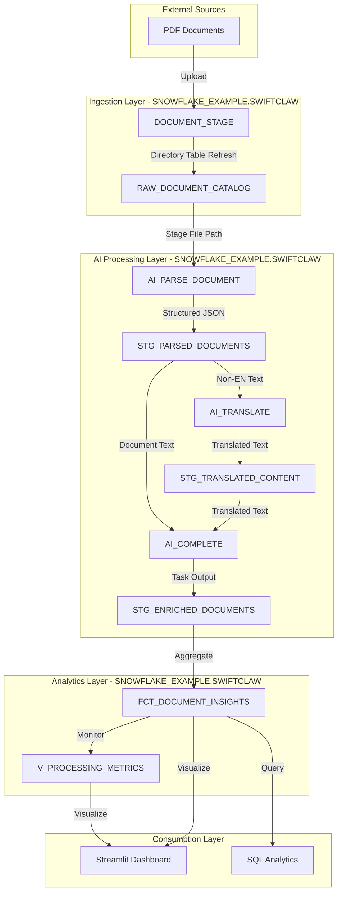

# Data Flow - AI Document Processing Demo

**Author:** SE Community  
**Last Updated:** 2026-01-21  
**Status:** Reference Implementation

**Reference Implementation:** This diagram reflects production-grade patterns. Review and customize security, networking, and logic for your organization before production deployment.

## Overview

This diagram shows how document data flows through the AI processing pipeline, from PDF ingestion to AI enrichment and analytics. The pipeline uses Dynamic Tables for orchestration and Snowflake Cortex AI Functions for document understanding.

## Diagram

## Data Flow Stages

### Stage 1: Document Ingestion
**Input:** PDF files uploaded to the internal stage  
**Process:** Stage directory is merged into `RAW_DOCUMENT_CATALOG` table  
**Output:** File metadata (path, size, language, type)  

### Stage 2: AI Parsing
**Input:** Files referenced by `RAW_DOCUMENT_CATALOG`  
**Process:** `AI_PARSE_DOCUMENT` extracts text and layout  
**Output:** Parsed JSON in `STG_PARSED_DOCUMENTS`  

### Stage 3: Translation
**Input:** Parsed content for non-English documents  
**Process:** `AI_TRANSLATE` converts content to English  
**Output:** Translated text in `STG_TRANSLATED_CONTENT`  

### Stage 4: Enrichment
**Input:** Parsed or translated text  
**Process:** Task calls `AI_COMPLETE` to produce structured JSON  
**Output:** Enriched fields in `STG_ENRICHED_DOCUMENTS`  

### Stage 5: Analytics
**Input:** Enrichment outputs  
**Process:** Aggregation into `FCT_DOCUMENT_INSIGHTS`  
**Output:** Business metrics and monitoring views  

## Notes

- Dynamic Tables orchestrate processing and refresh automatically.
- Uploading new PDFs to the stage triggers refresh within the target lag window.

---

**Last Updated:** 2026-01-21  
**Author:** SE Community

