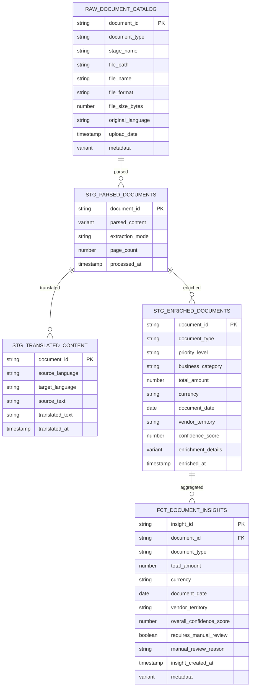

# Data Model - AI Document Processing Demo

**Author:** SE Community  
**Last Updated:** 2026-01-21  
**Status:** Reference Implementation

**Reference Implementation:** This diagram reflects production-grade patterns. Review and customize security, networking, and logic for your organization before production deployment.

## Overview

This diagram shows the schema and relationships for the AI document pipeline. The design uses a catalog table refreshed from the stage directory and Dynamic Tables for processing and insights.

## Diagram

## Notes

- `RAW_DOCUMENT_CATALOG` is a table refreshed from the stage directory by a task.
- STG_PARSED_DOCUMENTS and STG_TRANSLATED_CONTENT are Dynamic Tables.
- STG_ENRICHED_DOCUMENTS is a Dynamic Table using AI_EXTRACT + AI_CLASSIFY for structured enrichment.
- `FCT_DOCUMENT_INSIGHTS` is the primary analytics table used by the Streamlit dashboard.

---

**Last Updated:** 2026-01-21  
**Author:** SE Community

