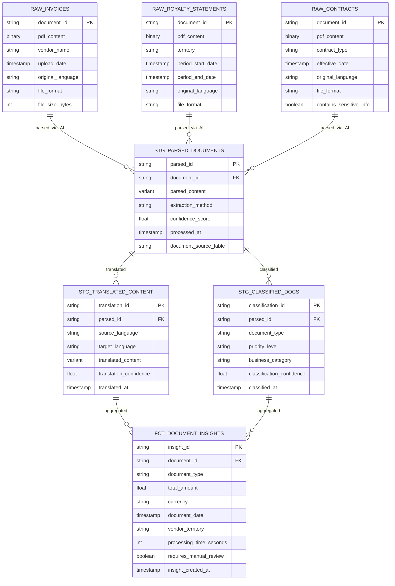

# Data Model - AI Document Processing Demo

**Author:** SE Community  
**Last Updated:** 2025-11-24  
**Expires:** 2025-12-24 (30 days from creation)  
**Status:** Reference Implementation

**Reference Implementation:** This code demonstrates production-grade architectural patterns and best practices. Review and customize security, networking, and logic for your organization's specific requirements before deployment.

## Overview

This diagram shows the database schema and relationships for AI-powered document processing in the entertainment industry. Data flows through three layers: Raw (document storage), Staging (AI processing), and Analytics (business insights).

## Diagram

## Component Descriptions

### Raw Layer (SFE_RAW_ENTERTAINMENT Schema)

**RAW_INVOICES**
- **Purpose**: Store original vendor invoice documents
- **Technology**: Binary PDF storage with metadata
- **Location**: `SNOWFLAKE_EXAMPLE.SFE_RAW_ENTERTAINMENT.RAW_INVOICES`
- **Key Columns**: `document_id` (PK), `pdf_content` (BINARY), `vendor_name`, `original_language`
- **Data Volume**: ~500 sample invoices

**RAW_ROYALTY_STATEMENTS**
- **Purpose**: Store royalty payment statements from distributors
- **Technology**: Binary PDF storage with period metadata
- **Location**: `SNOWFLAKE_EXAMPLE.SFE_RAW_ENTERTAINMENT.RAW_ROYALTY_STATEMENTS`
- **Key Columns**: `document_id` (PK), `pdf_content` (BINARY), `territory`, `period_start_date`
- **Data Volume**: ~300 sample royalty statements

**RAW_CONTRACTS**
- **Purpose**: Store entertainment industry contracts
- **Technology**: Binary PDF storage with sensitivity flags
- **Location**: `SNOWFLAKE_EXAMPLE.SFE_RAW_ENTERTAINMENT.RAW_CONTRACTS`
- **Key Columns**: `document_id` (PK), `pdf_content` (BINARY), `contract_type`, `contains_sensitive_info`
- **Data Volume**: ~50 sample contracts

### Staging Layer (SFE_STG_ENTERTAINMENT Schema)

**STG_PARSED_DOCUMENTS**
- **Purpose**: Store AI_PARSE_DOCUMENT results with structured content
- **Technology**: VARIANT data type for flexible JSON storage
- **Location**: `SNOWFLAKE_EXAMPLE.SFE_STG_ENTERTAINMENT.STG_PARSED_DOCUMENTS`
- **Key Columns**: `parsed_id` (PK), `document_id` (FK), `parsed_content` (VARIANT), `confidence_score`
- **AI Function**: SNOWFLAKE.CORTEX.PARSE_DOCUMENT with LAYOUT mode
- **Dependencies**: Depends on RAW_* tables

**STG_TRANSLATED_CONTENT**
- **Purpose**: Store AI_TRANSLATE results for multilingual documents
- **Technology**: VARIANT for translated content, confidence scoring
- **Location**: `SNOWFLAKE_EXAMPLE.SFE_STG_ENTERTAINMENT.STG_TRANSLATED_CONTENT`
- **Key Columns**: `translation_id` (PK), `parsed_id` (FK), `source_language`, `target_language`
- **AI Function**: SNOWFLAKE.CORTEX.TRANSLATE
- **Dependencies**: Depends on STG_PARSED_DOCUMENTS

**STG_CLASSIFIED_DOCS**
- **Purpose**: Store AI_FILTER classification results
- **Technology**: String classifications with confidence scores
- **Location**: `SNOWFLAKE_EXAMPLE.SFE_STG_ENTERTAINMENT.STG_CLASSIFIED_DOCS`
- **Key Columns**: `classification_id` (PK), `parsed_id` (FK), `document_type`, `priority_level`
- **AI Function**: SNOWFLAKE.CORTEX.CLASSIFY
- **Dependencies**: Depends on STG_PARSED_DOCUMENTS

### Analytics Layer (SFE_ANALYTICS_ENTERTAINMENT Schema)

**FCT_DOCUMENT_INSIGHTS**
- **Purpose**: Aggregated business insights across all documents
- **Technology**: Fact table with dimensional attributes
- **Location**: `SNOWFLAKE_EXAMPLE.SFE_ANALYTICS_ENTERTAINMENT.FCT_DOCUMENT_INSIGHTS`
- **Key Columns**: `insight_id` (PK), `document_id` (FK), `total_amount`, `processing_time_seconds`
- **AI Function**: SNOWFLAKE.CORTEX.SUMMARIZE for aggregation
- **Dependencies**: Depends on STG_TRANSLATED_CONTENT and STG_CLASSIFIED_DOCS

**V_PROCESSING_METRICS** (View)
- **Purpose**: Real-time monitoring of document processing pipeline
- **Technology**: SQL view aggregating pipeline metrics
- **Location**: `SNOWFLAKE_EXAMPLE.SFE_ANALYTICS_ENTERTAINMENT.V_PROCESSING_METRICS`
- **Key Metrics**: Processing success rate, average confidence scores, throughput
- **Dependencies**: Joins across all STG_* tables

## Data Type Details

| Column Type | Purpose | Example | Notes |
|-------------|---------|---------|-------|
| BINARY | Store PDF files | Invoice PDFs, contracts | Use SCOPED URL for external access |
| VARIANT | Store JSON AI results | Parsed document structure | Flexible schema for AI outputs |
| STRING | Store classifications | Document type, language code | UTF-8 encoding for multilingual |
| FLOAT | Store confidence scores | 0.0 - 1.0 range | AI model confidence metrics |
| TIMESTAMP_NTZ | Store processing times | When document was processed | No timezone for warehouse-centric |

## Relationships & Constraints

### Primary Keys
- All tables use string-based UUIDs for primary keys
- Format: `{table_prefix}_{uuid4}` (e.g., `INV_a1b2c3d4-e5f6-7890`)

### Foreign Keys
- **Document Lineage**: `document_id` traces back to source RAW_* table
- **Processing Lineage**: `parsed_id` links AI processing stages
- **Referential Integrity**: Enforced via application logic (Snowflake doesn't enforce FKs)

### Cardinality
- **1:Many** - One raw document → Many parsed versions (if reprocessed)
- **1:Many** - One parsed document → Many translations (different target languages)
- **1:1** - One parsed document → One classification (latest classification)

## Storage Optimization

### Table Types
- **RAW_* tables**: PERMANENT (7-day Time Travel for recovery)
- **STG_* tables**: TRANSIENT (1-day Time Travel, no Fail-safe for cost savings)
- **FCT_* tables**: PERMANENT (Business-critical insights)

### Clustering
- **RAW_INVOICES**: Clustered by `upload_date` for time-based queries
- **STG_PARSED_DOCUMENTS**: Clustered by `processed_at`, `document_source_table`
- **FCT_DOCUMENT_INSIGHTS**: Clustered by `document_date`, `document_type`

## Change History

See `.cursor/DIAGRAM_CHANGELOG.md` for version history.

---

**Last Updated:** 2025-11-24  
**Expires:** 2025-12-24  
**Author:** SE Community

