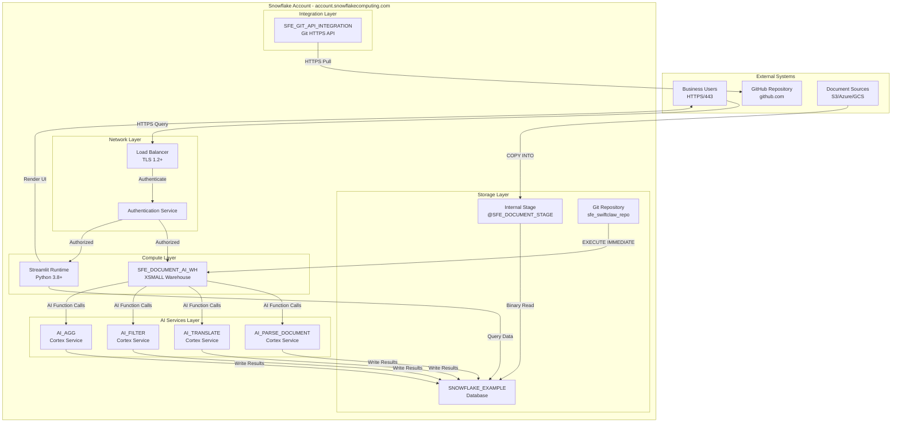

# Network Flow - AI Document Processing Demo

**Author:** SE Community
**Last Updated:** 2025-12-10
**Status:** Reference Implementation


**Reference Implementation:** This code demonstrates production-grade architectural patterns and best practices. Review and customize security, networking, and logic for your organization's specific requirements before deployment.

## Overview

This diagram shows the network architecture for the AI document processing demo, highlighting connections between external systems, Snowflake services, and the GitHub repository integration.

## Diagram



## Network Components

### External Connections

**Business Users**
- **Protocol:** HTTPS (TLS 1.2+)
- **Port:** 443
- **Authentication:** Snowflake username/password or SSO
- **Access Methods:**
  - Snowsight web UI
  - Streamlit in Snowflake
  - SQL clients (SnowSQL, ODBC, JDBC)
- **Network Requirements:** Outbound HTTPS to `*.snowflakecomputing.com`

**GitHub Repository**
- **URL:** https://github.com/sfc-gh-miwhitaker/swiftclaw.git
- **Protocol:** HTTPS (Git over HTTPS)
- **Authentication:** API Integration (no user credentials required)
- **Access Pattern:** Pull-only (read repository files)
- **Network Requirements:** Snowflake → GitHub outbound HTTPS on port 443

**Document Sources (Optional)**
- **Supported Cloud Storage:**
  - AWS S3: `s3://bucket-name/path/`
  - Azure Blob: `azure://account.blob.core.windows.net/container/`
  - GCS: `gs://bucket-name/path/`
- **Protocol:** HTTPS with cloud provider APIs
- **Authentication:** Cloud provider credentials via Snowflake storage integrations
- **Access Pattern:** Read-only (COPY INTO operations)

### Snowflake Internal Network

**Load Balancer**
- **Purpose:** Route user connections to available compute resources
- **Technology:** Snowflake-managed, auto-scaling
- **TLS Termination:** TLS 1.2 minimum, TLS 1.3 preferred
- **Health Checks:** Automatic warehouse health monitoring

**Authentication Service**
- **Purpose:** Verify user credentials and role-based access
- **Supported Methods:**
  - Username/Password
  - Key-pair authentication
  - OAuth (external providers)
  - SAML 2.0 SSO
- **Session Management:** Token-based with configurable timeout
- **MFA Support:** Duo Security integration (optional)

**Virtual Warehouse (SFE_DOCUMENT_AI_WH)**
- **Size:** XSMALL (1 server, 8 credits/hour)
- **Auto-Suspend:** 60 seconds idle
- **Auto-Resume:** Enabled
- **Network Isolation:** Runs in Snowflake VPC, no direct external access
- **Outbound Connections:** Only to Cortex AI services (internal)

**Streamlit Runtime**
- **Deployment:** Snowflake-managed container
- **Python Version:** 3.8+
- **Network Access:** Internal Snowflake network only
- **Data Access:** Via Snowflake session (no external DB connections)
- **Port:** N/A (accessed via Snowflake URL, not direct port)

### AI Services Layer

**Cortex AI Functions**
- **Deployment:** Snowflake-managed serverless compute
- **Network Access:** Internal only (called from warehouses)
- **Pricing Model:** Per-request, variable by function
- **Functions Used:**
  - `AI_PARSE_DOCUMENT` - Document text extraction
  - `AI_TRANSLATE` - Language translation
  - `AI_FILTER` - Document classification
  - `AI_AGG` - Cross-document aggregation
- **No External Network Access Required**

### Storage & Integration Layer

**SNOWFLAKE_EXAMPLE Database**
- **Location:** Snowflake-managed storage
- **Replication:** Automatic (Snowflake Fail-safe)
- **Network Access:** Internal only
- **Encryption:** AES-256 at rest, TLS in transit

**Git Repository Integration**
- **Integration Name:** `SFE_GIT_API_INTEGRATION`
- **Type:** Git HTTPS API
- **Allowed Prefix:** `https://github.com/sfc-gh-miwhitaker/`
- **Authentication:** GitHub token (stored as Snowflake secret)
- **Network Path:** Snowflake → GitHub via HTTPS
- **Usage:** `EXECUTE IMMEDIATE FROM @sfe_swiftclaw_repo/branches/main/sql/...`

## Security Architecture

### Network Security

**Inbound Rules:**
- ✅ HTTPS from business users (443)
- ❌ No direct database ports exposed
- ❌ No SSH access to warehouses
- ❌ No VPN required for demo

**Outbound Rules:**
- ✅ Snowflake → GitHub (HTTPS/443 for Git integration)
- ✅ Snowflake → Cloud Storage (HTTPS/443 for COPY INTO, optional)
- ❌ No other external connections

**Data in Transit:**
- All connections use TLS 1.2+
- Certificate validation enforced
- No unencrypted protocols

**Data at Rest:**
- AES-256 encryption for all data
- Snowflake-managed keys (default)
- Option for customer-managed keys (not used in demo)

### Access Control

**Role-Based Access Control (RBAC):**
```
ACCOUNTADMIN (setup only)
  └─ SYSADMIN (demo operations)
      └─ SFE_DEMO_ROLE (application role)
          └─ PUBLIC (read-only access)
```

**Object Privileges:**
- `SFE_DEMO_ROLE` granted USAGE on:
  - `SFE_DOCUMENT_AI_WH` warehouse
  - `SNOWFLAKE_EXAMPLE` database
  - All `SFE_*` schemas
- `SFE_DEMO_ROLE` granted SELECT on:
  - All tables in `SFE_ANALYTICS_ENTERTAINMENT` schema
- No row-level security in demo (all users see all data)

### Firewall & Network Policies

**Snowflake Network Policies (Optional for Production):**
```sql
-- Example network policy (not enabled in demo)
CREATE NETWORK POLICY allow_office_only
  ALLOWED_IP_LIST = ('203.0.113.0/24', '198.51.100.0/24')
  BLOCKED_IP_LIST = ();
```

**Recommendation:** Enable network policies for production deployments

## Deployment Network Flow

### Initial Deployment (via deploy_all.sql)

1. User opens Snowsight → HTTPS to Snowflake load balancer
2. User pastes `deploy_all.sql` → Authenticated via Snowflake
3. Script creates `SFE_GIT_API_INTEGRATION` → Snowflake validates GitHub access
4. Script creates Git repository → Snowflake pulls from GitHub HTTPS
5. Script runs `EXECUTE IMMEDIATE FROM` → Warehouse executes SQL from Git repo
6. SQL creates schemas/tables → Writes to Snowflake storage
7. SQL loads sample data → Writes to database
8. SQL creates Streamlit app → Deploys to Streamlit runtime

**Total Network Hops:** User → Snowflake → GitHub → Snowflake (circular)

### Operational Network Flow (Post-Deployment)

1. User accesses Streamlit dashboard → HTTPS to Snowflake
2. Streamlit queries `FCT_DOCUMENT_INSIGHTS` → Internal Snowflake network
3. Warehouse executes queries → Reads from database
4. AI functions process data → Internal Cortex service calls
5. Results returned to Streamlit → Rendered in user's browser

**All Operations:** Within Snowflake network (no external dependencies)

## Performance Considerations

### Network Latency
- **User ↔ Snowflake:** Typical 50-200ms (depends on user location)
- **Snowflake ↔ GitHub:** ~100-300ms (one-time during deployment)
- **Warehouse ↔ Database:** < 10ms (internal network)
- **Warehouse ↔ Cortex AI:** < 50ms (internal network)

### Bandwidth
- **Document Ingestion:** Depends on source (S3/Azure/GCS network speeds)
- **AI Processing:** Minimal (VARIANT data efficient)
- **Streamlit UI:** ~100KB per page load
- **No Bottlenecks:** All processing in Snowflake network

## Troubleshooting Network Issues

### Cannot Access Snowsight
- **Check:** Firewall allows outbound HTTPS to `*.snowflakecomputing.com`
- **Check:** Corporate proxy settings (if applicable)
- **Solution:** Contact IT to whitelist Snowflake domains

### Git Integration Fails
- **Check:** GitHub repository is public or API integration has valid token
- **Check:** `ALLOWED_PREFIXES` includes full repository URL
- **Solution:** Verify `SHOW API INTEGRATIONS LIKE 'SFE_GIT%'` shows `ENABLED = TRUE`

### Streamlit App Won't Load
- **Check:** User has USAGE privilege on `SFE_DOCUMENT_AI_WH`
- **Check:** Streamlit app deployed successfully (`SHOW STREAMLITS`)
- **Solution:** Grant role access: `GRANT USAGE ON WAREHOUSE SFE_DOCUMENT_AI_WH TO ROLE SFE_DEMO_ROLE;`

## Change History

See `.cursor/DIAGRAM_CHANGELOG.md` for version history.

---

**Last Updated:** 2025-11-24
**Author:** SE Community
