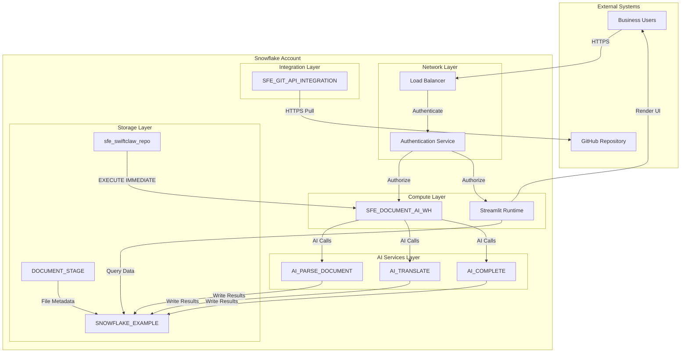

# Network Flow - AI Document Processing Demo

**Author:** SE Community  
**Last Updated:** 2026-01-21  
**Status:** Reference Implementation

**Reference Implementation:** This diagram reflects production-grade patterns. Review and customize security, networking, and logic for your organization before production deployment.

## Overview

This diagram shows the network architecture for the demo, highlighting connections between users, Snowflake services, and the GitHub repository integration.

## Diagram

## Network Components

### External Connections

**Business Users**
- Protocol: HTTPS (TLS 1.2+)  
- Port: 443  
- Access: Snowsight UI and Streamlit in Snowflake  

**GitHub Repository**
- URL: https://github.com/sfc-gh-miwhitaker/swiftclaw  
- Protocol: HTTPS (Git over HTTPS)  
- Authentication: API integration (no user credentials required)  

### Snowflake Internal Network

**Virtual Warehouse**
- Size: XSMALL  
- Auto-suspend: 60 seconds  
- Auto-resume: Enabled  

**Streamlit Runtime**
- Snowflake-managed runtime  
- Internal network access only  

### AI Services Layer

**Cortex AI Functions**
- `AI_PARSE_DOCUMENT`  
- `AI_TRANSLATE`  
- `AI_COMPLETE`  

### Storage and Integration

**Database and Stage**
- `SNOWFLAKE_EXAMPLE` database  
- `SWIFTCLAW.DOCUMENT_STAGE` internal stage  

**Git Integration**
- `SFE_GIT_API_INTEGRATION`  
- `sfe_swiftclaw_repo`  

---

**Last Updated:** 2026-01-21  
**Author:** SE Community

